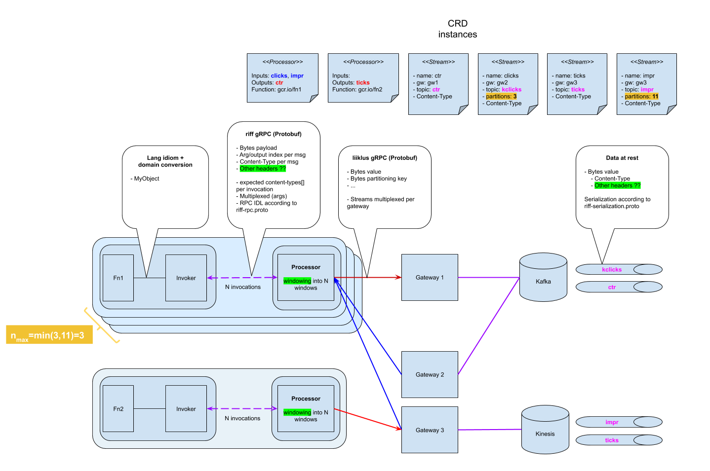

= riff Function Streaming Processor

image:https://github.com/projectriff/streaming-processor/workflows/CI/badge.svg["Build Status", link="https://github.com/projectriff/streaming-processor/actions"]

This repository contains the sources of the riff function streaming processor, a component used when dealing with
streaming functions.

== Purpose
When dealing with streaming functions, one creates a `processor` in riff like so:

[source, bash]
----
riff streaming processor create example --function-ref some-existing-fn \
    --input  input-stream \
    --input  i2:maybe-another-input \
    --output some-output-stream \
    --output out3:maybe-another \
    --output even-a-third
----

This creates a pod made of two containers.
This component will run in the function pod, alongside the function container, and will

1. continuously pump data from any of the function input streams (`input-stream` and `maybe-another-input`
in the example above) out of the stream gateway(s)
2. extract the message payloads from the serialized form used in the
broker(s) (see link:src/main/proto/riff-serialization.proto[riff-serialization.proto])
3. decide how to craft windows of function invocation (currently hardcoded to one minute of wallclock time)
4. invoke the function over RPC, multiplexing the many input streams over the single stream allowed
by the RPC spec (see link:src/main/proto/riff-rpc.proto[riff-rpc.proto])
5. upon reception of result frames, de-mux messages and serialize them back to the appropriate output streams
(`some-output-stream`, `maybe-another` and `even-a-third` in the example above).

Notice that the number of input and output streams can be different and depends entirely on
how the actual function is implemented. Likewise, the rate at which messages flow in and out
is entirely dictated by the function implementation (one piece of input may trigger the
emission of N output messages, in quick succession or over time).

== Building
This component is written in Java and leverages the following technologies:

- https://spring.io/projects/spring-boot[Spring Boot] as the overall framework, in particular for crafting an executable jar,
- https://github.com/bsideup/liiklus[Liiklus] as the _stream gateway_,
- https://grpc.io/[gRPC] as both the RPC protocol to interact with liiklus and the riff RPC invocation protocol,
- https://projectreactor.io/[Reactor] and https://github.com/salesforce/reactive-grpc/tree/master/reactor[reactor-grpc] as the main event loop mechanism, preserving back-pressure from output to input.

To build the project, assuming a fresh checkout of this repository as the current directory:

[source,bash]
----
mvn package
----

To build and create (and push) a docker image:

[source,bash]
----
mvn package com.google.cloud.tools:jib-maven-plugin:1.3.0:build -Dimage=<MY IMAGE>
----

== Running
When run, the processor expects the following environment variables to be set:

- `INPUT_NAMES`: a comma separated list of N input parameter logical names,
- `OUTPUT_NAMES`: a comma separated list of M output result logical names,
- `GROUP`: a string identifier that will be used as the _consumer group_ for the processor.
- `FUNCTION`: location of the function RPC server, in the form `host:port`,
- `CNB_BINDINGS`: directory location of stream https://github.com/projectriff/riff/blob/master/rfc/rfc-0002-bindings.md[bindings information]. The processor will read N bindings at `$CNB_BINDINGS/input_xxx` and M bindings at `$CNB_BINDINGS/output_xxx`.
